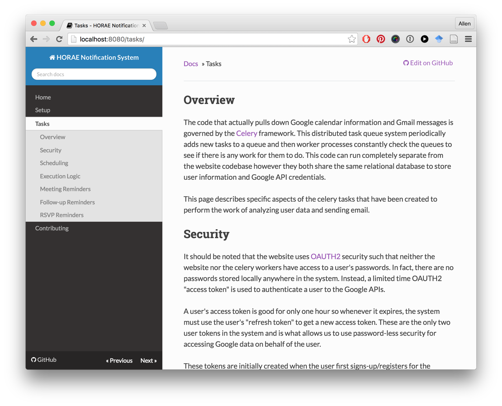

# Anemoi

**The greatest Slack chatbot ever devised by man**

## Overview

Anemoi is a sample Slack chatbot exercise that can respond to simple weather requests.  

## Documentation

Further documentation can be found in the [docs](https://github.com/looselycoupled/anemoi/tree/master/docs) directory.  The documentation has been created with [mkdocs](http://www.mkdocs.org/) to make it easier to review and maintain project information.  To run a local webserver displaying the HTML version make sure you have the development dependencies installed and run with the following command.

    mkdocs serve --dev-addr=0.0.0.0:8080

Once the documentation server has started up, open a browser to view the documentation:

## Setup

See the [Setup](https://github.com/looselycoupled/anemoi/tree/master/docs/setup.md) page for more information on how to configure a production environment.

## Tests

This project includes a suite of automated tests.  For your convenience, a `Makefile` has been provided with a target for evaluating the test suite.  Use the following command to run the tests.

    $ make test

## Branches / Git Workflow

When working on Anemoi, keep in mind that the project is set up in a typical production/release/development cycle as described in _[A Successful Git Branching Model](http://nvie.com/posts/a-successful-git-branching-model/)_. A typical workflow is as follows:

1. Select an issue from the [issues page](https://github.com/looselycoupled/anemoi/issues) - preferably one that is "ready" then move it to "in-progress" using labels or just comment that you are working on it.

2. Create a branch off of develop called "feature-[feature name]", work and commit into that branch.

        ~$ git checkout -b feature-myfeature develop

3. Once you are done working (and everything is tested) merge your feature into develop.

        ~$ git checkout develop
        ~$ git merge --no-ff feature-myfeature
        ~$ git branch -d feature-myfeature
        ~$ git push origin develop

4. Repeat. Releases will be routinely pushed into master via release branches, then deployed to the server.

## Versioning

This codebases uses a form of [Semantic Versioning](http://semver.org/) to structure version numbers.  In general, the results of each sprint will increment the minor version while any special releases (bug fixes, etc.) will increment the patch number.

## About

In Greek mythology the [Anemoi](https://en.wikipedia.org/wiki/Anemoi) were wind gods who were each ascribed a cardinal direction from which their respective winds came.  They were also associated with various seasons and weather conditions.  The project picture is of a an engraving of Zephyrus - the west wind and bringer of light spring and early summer breezes.

### Attribution

The image used in this README, [zephyrus wind engraving by Ken Mayer](https://www.flickr.com/photos/ken_mayer/4149824777) from [Flickr](https://www.flickr.com/), is provided for reuse with some rights reserved through the [Creative Commons Attribution 2.0 Generic](https://creativecommons.org/licenses/by/2.0/) license.
