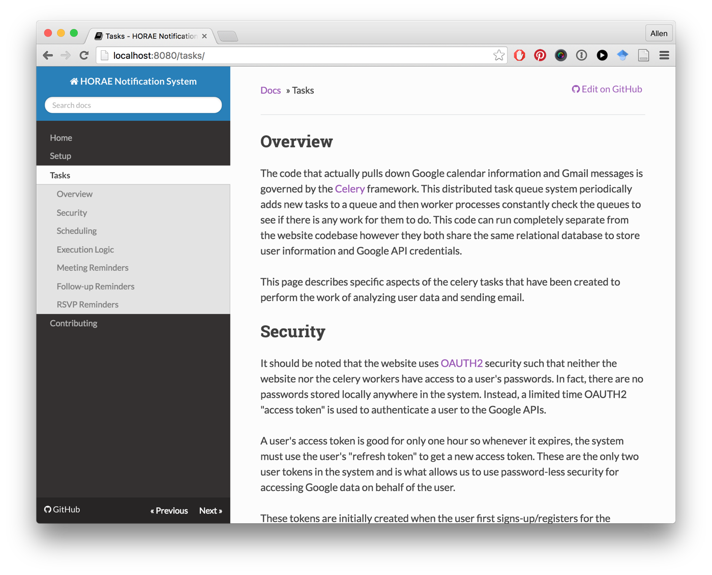

# Overview

This page contains extra information of use for future developers of the project.

## Issue Management

This project makes heavy use of the [Github Issues](https://github.com/looselycoupled/anemoi/issues) portion of the repository.  Various milestones and custom labels have been developed to help plan and manage the work.

## Documentation

This documentation can be found in the [docs](https://github.com/looselycoupled/anemoi/tree/master/docs) directory and has been created with [mkdocs](http://www.mkdocs.org/) to make it easier to review and maintain project information.  To run a local webserver displaying the HTML version make sure you have the development dependencies installed and run with the following command.

    # startup documentation webserver
    mkdocs serve --dev-addr=0.0.0.0:8080

    # start a new browser on unix systems
    open http://localhost:8080

(sample image)

To build the HTML version to put online or within Github Pages use the following command and the processed website will be placed in a new `site` directory.

    mkdocs build

## Tests

This project includes a suite of automated tests.  For your convenience, a `Makefile` has been provided with a target for evaluating the test suite.  Use the following command to run the tests.

    $ make test

## Branches / Git Workflow

When working on Horae, keep in mind that the project is set up in a typical production/release/development cycle as described in _[A Successful Git Branching Model](http://nvie.com/posts/a-successful-git-branching-model/)_. A typical workflow is as follows:

1. Select an issue from the [issues page](https://github.com/looselycoupled/anemoi/issues) - preferably one that is "ready" then move it to "in-progress" using labels or just comment that you are working on it.

2. Create a branch off of develop called "feature-[feature name]", work and commit into that branch.

        ~$ git checkout -b feature-myfeature develop

3. Once you are done working (and everything is tested) merge your feature into develop.

        ~$ git checkout develop
        ~$ git merge --no-ff feature-myfeature
        ~$ git branch -d feature-myfeature
        ~$ git push origin develop

4. Repeat. Releases will be routinely pushed into master via release branches, then deployed to the server.

## Versioning

This codebases uses a form of [Semantic Versioning](http://semver.org/) to structure version numbers.  In general, the results of each sprint will increment the minor version while any special releases (bug fixes, etc.) will increment the patch number.
